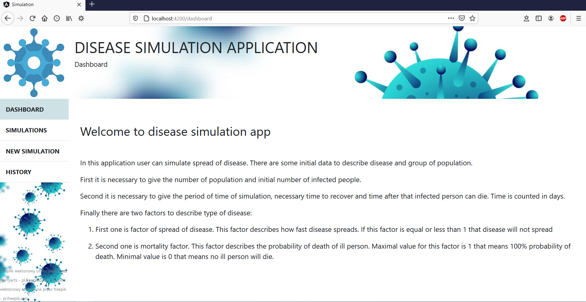
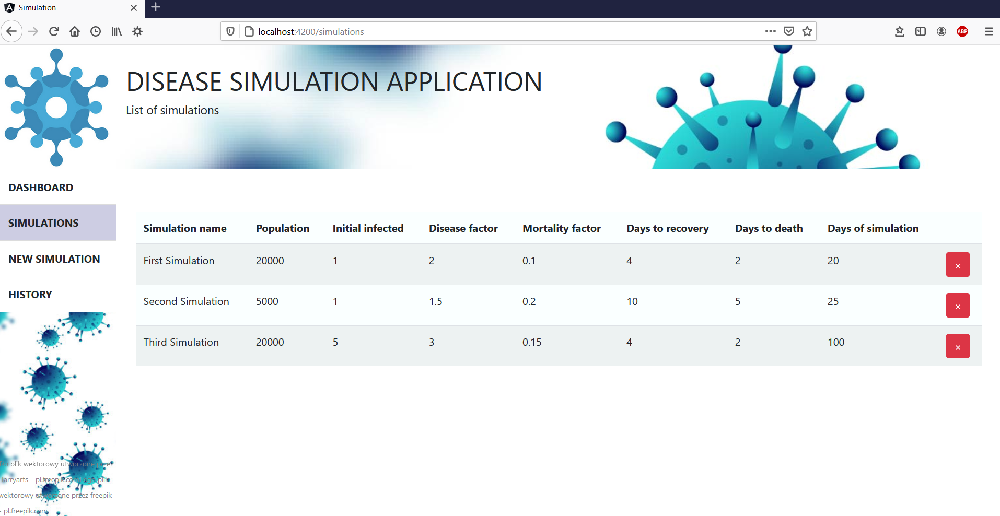
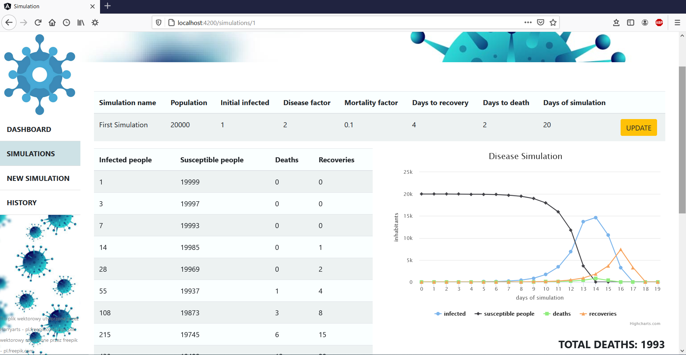
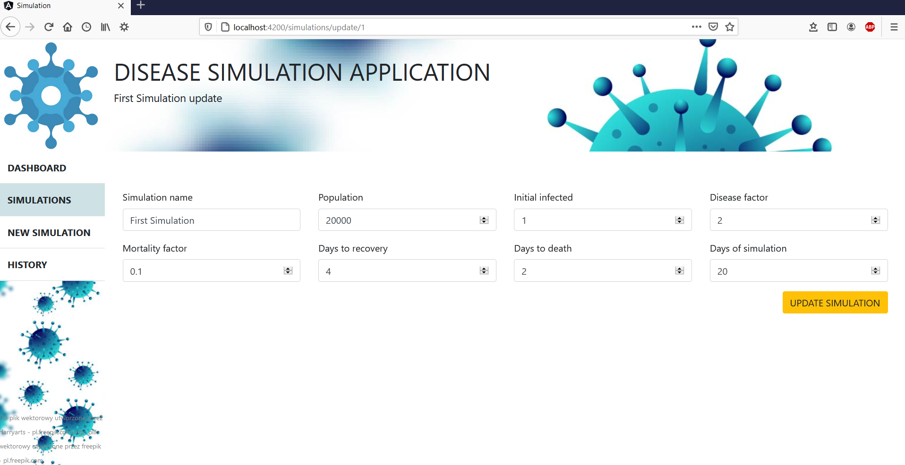
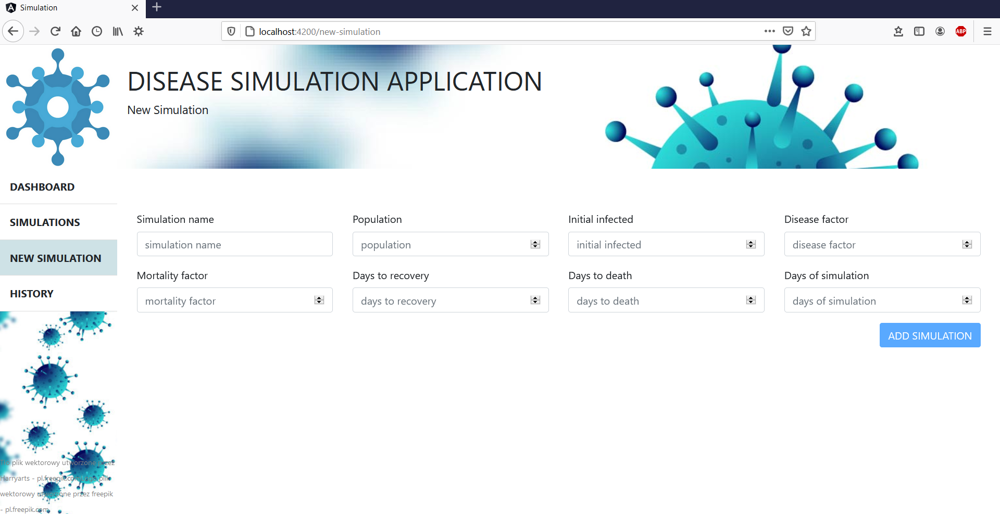
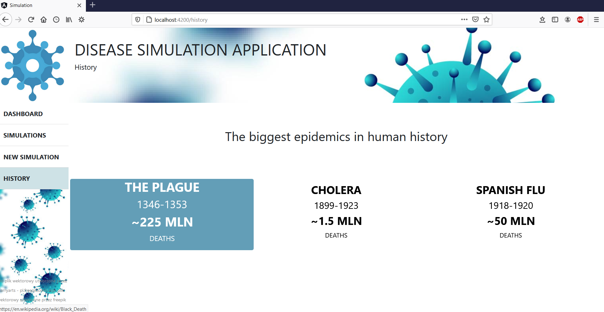

# DiseaseSimulationApp

In this project user can simulate spread of disease. It is necessary to give a basic dataset described on dashboard of application.

## Table of content
* [General info](#general-info)
* [Technologies](#technologies)
* [Setup](#setup)
* [Application](#application)

## General info
In this repository there are two parts, separate for backend and frontend. In backend there are all calculates and manage the database. In frontend there is GUI.
On dashboard there is a simple instruction how to use application. At the beginning there are 3 simulations in application. Additionally user can add new simulation, update
or delete existing simulations. The results of simulations are display in table and as graph. In project it was used Highcharts to present result in graphic form. At the end
there are some hyperlinks to informations about the biggest epidemics in history.

## Technologies
Project is created with:
* Java version 11
* Angular version 11.2.7
* Bootstrap version 4.6.0
* Highcharts

## Setup
To run this project, download it to IDE. In repository there are two separate parts, backend and frontend, on two branches. Run they separately. After that go to localhost:4200.

## Application
* Dashboard

* Simulations

* Simulation display

* Update simulation

* Add simulation

* Additional information about biggest epidemics in history

